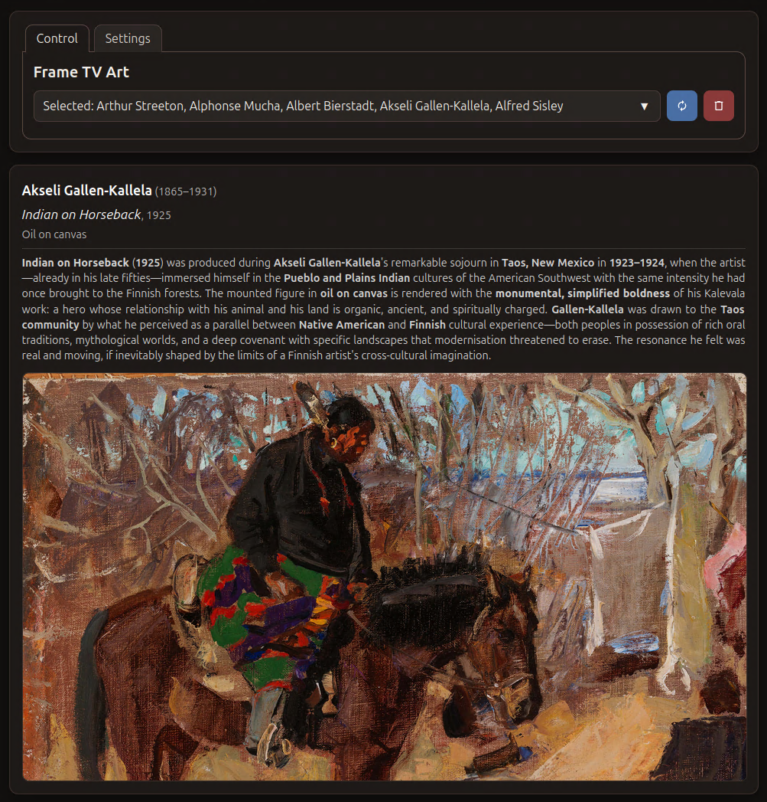
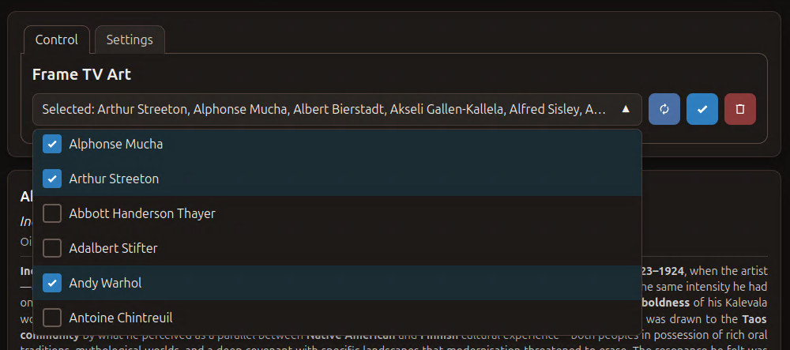
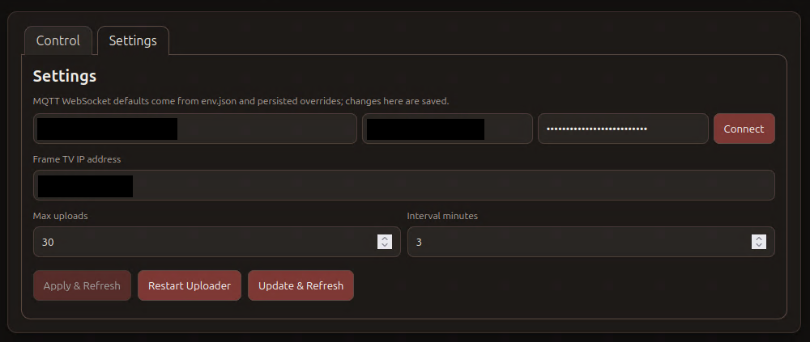

# Samsung Frame TV Art Uploader

[](https://buymeacoffee.com/kohlerryan)

Automatically uploads and rotates artwork on a **Samsung Frame TV**, with Home Assistant integration via MQTT for live entity state, collection selection, and a custom Lovelace card.

Built on top of [NickWaterton/samsung-tv-ws-api](https://github.com/NickWaterton/samsung-tv-ws-api) for Samsung TV WebSocket communication.

| Home Assistant Card | Web UI |
|---|---|
|  |  |

## Features

- Fetches artwork collections from git repositories (or uses a local bind-mount)
- Rotates a randomized or sequential set of images on the TV on a configurable schedule
- Publishes artwork metadata (title, artist, description, collection) to MQTT for Home Assistant
- MQTT discovery — entities are auto-created in HA with no manual YAML
- Built-in web UI (port 8080) for collection selection, settings, and manual refresh
- [Home Assistant Lovelace card](https://github.com/kohlerryan/samsung-tv-art-card) with live progress display during refresh operations
- mDNS advertisement (`samsung-tv-art.local`) via Avahi

## Requirements

- Samsung Frame TV (The Frame, any year with Art Mode)
- MQTT broker (e.g. Mosquitto)
- Docker host on the same LAN as the TV
- _(Optional)_ Home Assistant with MQTT integration

## Quick start

**1. Copy and edit the env file**
```bash
cp examples/samsung-tv-art.env.example samsung-tv-art.env
```
Open `samsung-tv-art.env` and set at minimum:
- `SAMSUNG_TV_ART_TV_IP` — the IP address of your Frame TV
- `SAMSUNG_TV_ART_MQTT_HOST` — your MQTT broker (if using HA integration)

**2. Copy and edit the compose file**
```bash
cp examples/docker-compose.yml docker-compose.yml
```

**3. Start the container**
```bash
docker compose up -d
```

Open the web UI at `http://samsung-tv-art.local:8080` (or `http://<host-ip>:8080`).

## Artwork collections

### Collection folder structure

Whether you use Git repos or a local bind-mount, every collection follows the same layout:

```
CollectionName/
  artwork_data.csv          ← required: metadata for every image in this folder
  Artist_Year_Title.jpg
  Artist_Year_Title.jpg
  ...
```

The folder name (`CollectionName`) becomes the selectable collection name in the UI and HA card.

---

### artwork_data.csv — required format

Each collection **must** include an `artwork_data.csv` file at its root.  
The file must be UTF-8 encoded with a header row. The following columns are recognized:

| Column | Required | Description |
|---|---|---|
| `artwork_file` | **Yes** | Exact filename of the image (e.g. `Monet_1906_Water_Lilies.jpg`) |
| `artwork_dir` | **Yes** | Folder name this image belongs to — must match the collection folder name |
| `artist_name` | Recommended | Artist's full name — shown bold in the HA card |
| `artist_lifespan` | Recommended | e.g. `1840–1926` — shown next to artist name |
| `artwork_title` | Recommended | Title of the artwork — shown in italics in the HA card |
| `artwork_year` | Recommended | Year created — shown next to the title |
| `artwork_medium` | Optional | Medium (e.g. `Oil on canvas`) — shown below the title |
| `artwork_description` | Optional | Description text. Supports **Markdown**: `**bold**`, `*italic*`, `***bold italic***`, `` `code` `` |

> **Note:** `artwork_file` and `artwork_dir` are mandatory. Rows missing `artwork_file` are silently skipped. If no `artwork_data.csv` is present the images still rotate but the HA card will show no metadata.

A template is provided at [`examples/artwork_data.csv.template`](examples/artwork_data.csv.template).

**Example `artwork_data.csv`:**
```csv
artwork_file,artwork_dir,artist_name,artist_lifespan,artwork_title,artwork_year,artwork_medium,artwork_description
Monet_1906_Water_Lilies.jpg,Monet,Claude Monet,1840–1926,Water Lilies,1906,Oil on canvas,One of Monet's most celebrated series.
Monet_1877_Gare_Saint_Lazare.jpg,Monet,Claude Monet,1840–1926,Gare Saint-Lazare,1877,Oil on canvas,Painted as part of a series on light and atmosphere.
```

---

### Image filename convention

Filenames are parsed as a fallback when no CSV row is found for a file. Use this naming pattern for best results:

```
ArtistName_Year_Title of Work.jpg
```

Examples:
- `Monet_1906_Water_Lilies.jpg`
- `VanGogh_1889_Starry_Night.jpg`

---

### Option A — Git repositories

Each git repository should contain one collection folder's worth of images and an `artwork_data.csv`.  
The recommended repo structure is:

```
your-collection-repo/
  artwork_data.csv
  Monet_1906_Water_Lilies.jpg
  Monet_1877_Gare_Saint_Lazare.jpg
```

Set `SAMSUNG_TV_ART_COLLECTIONS` in your env file as a space- or comma-separated list of URLs:

```env
SAMSUNG_TV_ART_COLLECTIONS=https://github.com/you/Monet.git https://github.com/you/Degas.git
```

> **Note:** `.env` files do not support multiline values. If you have many repos, use a `collections.list` file instead (see below).

Click **Update & Refresh** in the web UI or HA card to fetch the latest commits and re-seed the TV at any time.

#### Ready-made artist collections

A set of pre-built, ready-to-use artist collections is available at **[github.com/kohlerryan](https://github.com/kohlerryan?tab=repositories)**. Each repo follows the required structure and includes a fully populated `artwork_data.csv`.

Available collections:

| Repository | Artist |
|---|---|
| [Abbott_Handerson_Thayer](https://github.com/kohlerryan/Abbott_Handerson_Thayer) | Abbott Handerson Thayer |
| [Adalbert_Stifter](https://github.com/kohlerryan/Adalbert_Stifter) | Adalbert Stifter |
| [Akseli_Gallen-Kallela](https://github.com/kohlerryan/Akseli_Gallen-Kallela) | Akseli Gallen-Kallela |
| [Albert_Bierstadt](https://github.com/kohlerryan/Albert_Bierstadt) | Albert Bierstadt |
| [Alfred_Sisley](https://github.com/kohlerryan/Alfred_Sisley) | Alfred Sisley |
| [Alphonse_Mucha](https://github.com/kohlerryan/Alphonse_Mucha) | Alphonse Mucha |
| [Andy_Warhol](https://github.com/kohlerryan/Andy_Warhol) | Andy Warhol |
| [Antoine_Chintreuil](https://github.com/kohlerryan/Antoine_Chintreuil) | Antoine Chintreuil |
| [Arthur_Streeton](https://github.com/kohlerryan/Arthur_Streeton) | Arthur Streeton |
| [Banksy](https://github.com/kohlerryan/Banksy) | Banksy |
| [Berthe_Morisot](https://github.com/kohlerryan/Berthe_Morisot) | Berthe Morisot |
| [Camille_Pissarro](https://github.com/kohlerryan/Camille_Pissarro) | Camille Pissarro |
| [Charles_Marion_Russell](https://github.com/kohlerryan/Charles_Marion_Russell) | Charles Marion Russell |
| [Childe_Hassam](https://github.com/kohlerryan/Childe_Hassam) | Childe Hassam |
| [Claude_Monet](https://github.com/kohlerryan/Claude_Monet) | Claude Monet |
| [Diego_Velazquez](https://github.com/kohlerryan/Diego_Velazquez) | Diego Velázquez |
| [Edgar_Degas](https://github.com/kohlerryan/Edgar_Degas) | Edgar Degas |
| [Edouard_Manet](https://github.com/kohlerryan/Edouard_Manet) | Édouard Manet |
| [Edvard_Munch](https://github.com/kohlerryan/Edvard_Munch) | Edvard Munch |
| [Edward_Hopper](https://github.com/kohlerryan/Edward_Hopper) | Edward Hopper |
| [El_Greco](https://github.com/kohlerryan/El_Greco) | El Greco |
| [Eugene_Boudin](https://github.com/kohlerryan/Eugene_Boudin) | Eugène Boudin |
| [Eugene_Delacroix](https://github.com/kohlerryan/Eugene_Delacroix) | Eugène Delacroix |
| [Francois_Boucher](https://github.com/kohlerryan/Francois_Boucher) | François Boucher |
| [Franz_Marc](https://github.com/kohlerryan/Franz_Marc) | Franz Marc |
| [Frederic_Remington](https://github.com/kohlerryan/Frederic_Remington) | Frederic Remington |
| [Frederick_McCubbin](https://github.com/kohlerryan/Frederick_McCubbin) | Frederick McCubbin |
| [George_Stubbs](https://github.com/kohlerryan/George_Stubbs) | George Stubbs |
| [George_Wesley_Bellows](https://github.com/kohlerryan/George_Wesley_Bellows) | George Wesley Bellows |
| [Georges_Seurat](https://github.com/kohlerryan/Georges_Seurat) | Georges Seurat |
| [Gustav_Courbet](https://github.com/kohlerryan/Gustav_Courbet) | Gustav Courbet |
| [Gustave_Caillebotte](https://github.com/kohlerryan/Gustave_Caillebotte) | Gustave Caillebotte |

To use any of these, add their URLs to `SAMSUNG_TV_ART_COLLECTIONS` as a space-separated list. For example, to display Monet and Bierstadt:

```env
SAMSUNG_TV_ART_COLLECTIONS=https://github.com/kohlerryan/Claude_Monet.git https://github.com/kohlerryan/Albert_Bierstadt.git
```

For many collections, the env var approach gets unwieldy. Instead, create a `data/collections.list` file with one URL per line — this file takes effect automatically and supports as many repos as you like:

```
https://github.com/kohlerryan/Abbott_Handerson_Thayer.git
https://github.com/kohlerryan/Adalbert_Stifter.git
https://github.com/kohlerryan/Akseli_Gallen-Kallela.git
https://github.com/kohlerryan/Albert_Bierstadt.git
https://github.com/kohlerryan/Alfred_Sisley.git
https://github.com/kohlerryan/Alphonse_Mucha.git
https://github.com/kohlerryan/Andy_Warhol.git
https://github.com/kohlerryan/Antoine_Chintreuil.git
https://github.com/kohlerryan/Arthur_Streeton.git
https://github.com/kohlerryan/Banksy.git
https://github.com/kohlerryan/Berthe_Morisot.git
https://github.com/kohlerryan/Camille_Pissarro.git
https://github.com/kohlerryan/Charles_Marion_Russell.git
https://github.com/kohlerryan/Childe_Hassam.git
https://github.com/kohlerryan/Claude_Monet.git
https://github.com/kohlerryan/Diego_Velazquez.git
https://github.com/kohlerryan/Edgar_Degas.git
https://github.com/kohlerryan/Edouard_Manet.git
https://github.com/kohlerryan/Edvard_Munch.git
https://github.com/kohlerryan/Edward_Hopper.git
https://github.com/kohlerryan/El_Greco.git
https://github.com/kohlerryan/Eugene_Boudin.git
https://github.com/kohlerryan/Eugene_Delacroix.git
https://github.com/kohlerryan/Francois_Boucher.git
https://github.com/kohlerryan/Franz_Marc.git
https://github.com/kohlerryan/Frederic_Remington.git
https://github.com/kohlerryan/Frederick_McCubbin.git
https://github.com/kohlerryan/George_Stubbs.git
https://github.com/kohlerryan/George_Wesley_Bellows.git
https://github.com/kohlerryan/Georges_Seurat.git
https://github.com/kohlerryan/Gustav_Courbet.git
https://github.com/kohlerryan/Gustave_Caillebotte.git
```

> Save this as `data/collections.list` in the directory where you run `docker compose`. The `data/` folder is already bind-mounted by the default compose file.

### Option B — Local bind-mount

Place collection subdirectories inside `./media`, each with their own `artwork_data.csv`:
```
media/
  Monet/
    artwork_data.csv
    Monet_1906_Water_Lilies.jpg
    ...
  Degas/
    artwork_data.csv
    ...
```

Each subdirectory becomes a selectable collection. The container maps `./media` → `/app/frame_tv_art_collections`.

## Configuration

All settings are controlled via environment variables. Copy `examples/samsung-tv-art.env.example` to `samsung-tv-art.env` for a fully commented reference.

Key variables:

| Variable | Default | Description |
|---|---|---|
| `SAMSUNG_TV_ART_TV_IP` | _(required)_ | IP address of the Frame TV |
| `SAMSUNG_TV_ART_UPDATE_MINUTES` | `30` | Artwork rotation interval |
| `SAMSUNG_TV_ART_MAX_UPLOADS` | `30` | Max images kept on TV at once |
| `SAMSUNG_TV_ART_SEQUENTIAL` | `false` | `true` = fixed order, `false` = shuffle |
| `SAMSUNG_TV_ART_MQTT_HOST` | — | MQTT broker hostname or IP |
| `SAMSUNG_TV_ART_COLLECTIONS` | — | Space- or comma-separated git repo URLs (for many repos, use `data/collections.list` instead) |
| `SAMSUNG_TV_ART_GITHUB_TOKEN` | — | GitHub PAT for private repos |
| `SAMSUNG_TV_ART_FETCH_ON_START` | `false` | Fetch collections on container start |
| `SAMSUNG_TV_ART_LOCAL_WEB` | `false` | Enable the web UI on port 8080 |
| `SAMSUNG_TV_ART_MDNS_ENABLE` | `true` | Advertise via mDNS as `<hostname>.local` |

See `examples/samsung-tv-art.env.example` for the full list with descriptions.

## Web UI

When `SAMSUNG_TV_ART_LOCAL_WEB=true`, a web interface is available at `http://samsung-tv-art.local:8080`.

| Collections & Control | Settings |
|---|---|
|  |  |

- **Collections** tab — select which collections are active and trigger a refresh
- **Settings** tab — adjust rotation interval, upload limit, sequence mode, and more without restarting the container

## Home Assistant card

The Lovelace card is available as a standalone repository: **[kohlerryan/samsung-tv-art-card](https://github.com/kohlerryan/samsung-tv-art-card)**

It is also bundled in this repo under `ha-card/`.  
See [`ha-card/README.md`](ha-card/README.md) for installation steps and [`examples/ha-lovelace-card.yaml.example`](examples/ha-lovelace-card.yaml.example) for a complete card configuration.

| Card — Collections & Control | Card — Settings |
|---|---|
|  |  |

### Mixed-content / image URLs

Browsers block HTTP image requests from HTTPS pages. If HA is served over HTTPS, configure both URL fields in the card so it can pick the right one:

```yaml
image_path_http: http://10.0.0.10:8080/app/frame_tv_art_collections
image_path_https: https://samsung-tv-art.yourdomain.com/app/frame_tv_art_collections
```

Or copy the media folder into HA's `www` directory to serve images from `/local`:

```bash
docker cp samsung-tv-art:/app/frame_tv_art_collections/. \
  /path/to/ha-config/www/frame_tv_art_collections/
```

Then set `image_path: /local/frame_tv_art_collections` in the card config.

## Persistent data

The `./data` bind-mount stores files that survive container restarts:

| File | Purpose |
|---|---|
| `data/token_file.txt` | TV authentication token (auto-created on first connect) |
| `data/uploaded_files_cache.json` | Maps local filenames to TV content IDs |
| `data/overrides.env` | Runtime settings overrides (written by web UI Settings panel) |
| `data/collections.list` | Alternative to env var — one git URL per line |

## MQTT topics

| Topic | Direction | Description |
|---|---|---|
| `frame_tv/selected_artwork/state` | publish | Currently displayed artwork filename |
| `frame_tv/selected_artwork/attributes` | publish | Full artwork metadata (title, artist, description, …) |
| `frame_tv/selected_collections/state` | publish / subscribe | Active collection names |
| `frame_tv/collections/attributes` | publish | All available collections list |
| `frame_tv/cmd/collections/refresh` | subscribe | Trigger a Refresh |
| `frame_tv/cmd/settings/sync_collections` | subscribe | Trigger Update & Refresh (git fetch + reseed) |
| `frame_tv/ack/collections/refresh` | publish | Progress acks during refresh |

## Repository structure

```
samsung-tv-art/
├── Dockerfile
├── start.sh               — container entrypoint: fetches collections, starts uploader
├── uploader.py            — main TV uploader and MQTT integration
├── serve.py               — minimal HTTP server for the web UI
├── assets/
│   ├── standby.png        — default standby artwork baked into the image
│   ├── hacard.png         — HA card screenshot
│   ├── hacard_control.png — HA card collections/control panel screenshot
│   ├── hacard_settings.png— HA card settings panel screenshot
│   ├── webui.png          — web UI screenshot
│   ├── webui_control.png  — web UI collections/control panel screenshot
│   └── webui_settings.png — web UI settings panel screenshot
├── ha-card/
│   ├── samsung-tv-art-card.js   — Home Assistant Lovelace card
│   └── README.md
├── scripts/
│   ├── fetch_collections.sh     — git clone/pull collection repos at runtime
│   ├── aggregate_csv.py         — merges per-collection CSVs into a single artwork_data.csv
│   └── bake_addons.sh           — build-time alternative to fetch_collections.sh
├── www/
│   └── index.html         — web UI source (baked into container image)
├── examples/
│   ├── docker-compose.yml
│   ├── samsung-tv-art.env.example
│   ├── ha-lovelace-card.yaml.example
│   └── artwork_data.csv.template  — copy and fill in for each collection
├── data/                  — bind-mount target (gitignored contents)
└── media/                 — bind-mount target for local artwork (gitignored contents)
```

## Troubleshooting

**TV not connecting** — Check `SAMSUNG_TV_ART_TV_IP` and ensure the container is on the same network as the TV. The TV may prompt for a pairing confirmation on first connect.

**No entities in HA** — Confirm `SAMSUNG_TV_ART_MQTT_DISCOVERY=true` and that your MQTT broker is reachable from the container.

**Images not showing in HA card** — Open the browser console and look for `FRAME-TV-ART-CARD: computed bgUrl`. Mixed-content errors mean you need to use `image_path_https` or serve images from `/local`.

**Check container logs:**
```bash
docker logs -f samsung-tv-art
```

## Acknowledgements

- **[samsung-tv-ws-api](https://github.com/NickWaterton/samsung-tv-ws-api)** by [NickWaterton](https://github.com/NickWaterton) — the WebSocket API library that handles all communication with the Samsung Frame TV, including art upload, content management, and art mode control.

## License

MIT — see [LICENSE](LICENSE).


