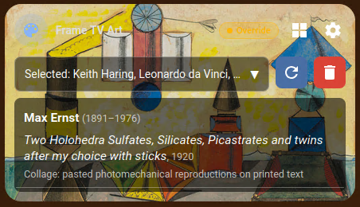
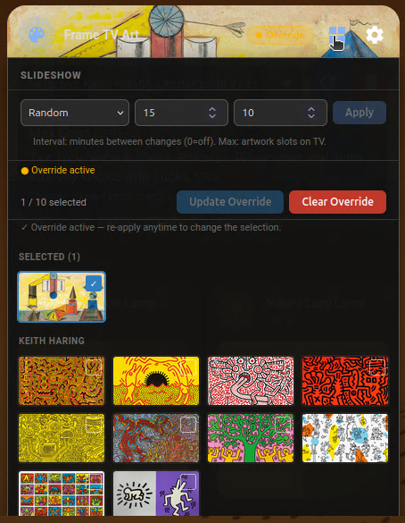
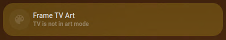
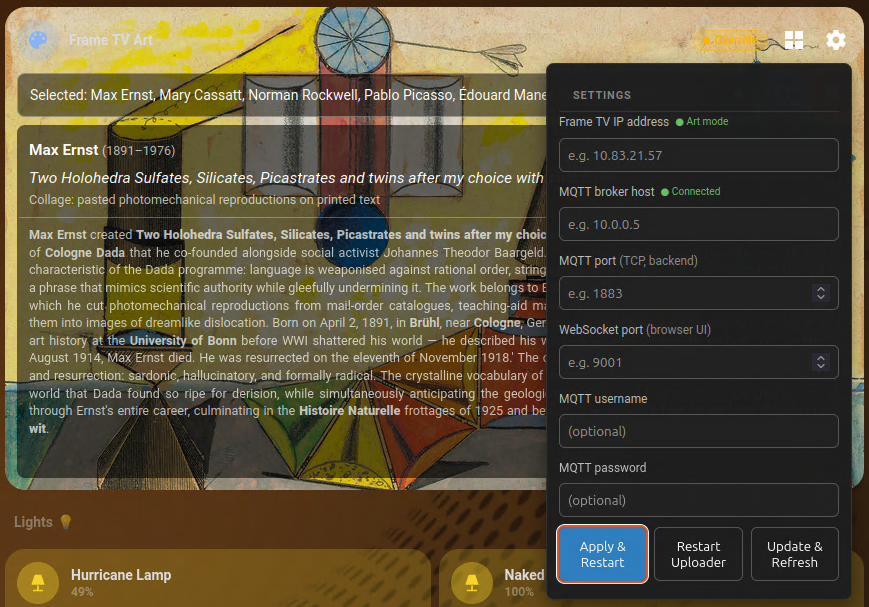

# Samsung Frame TV Art Card

[](https://www.buymeacoffee.com/kohlerryan)

A custom [Home Assistant](https://www.home-assistant.io/) Lovelace card for controlling a Samsung Frame TV art display — browse collections, trigger artwork reseeds, and monitor live refresh progress, all from your HA dashboard.



---

> **Upgrading from v0.1.x?** See the [v0.2.0 release notes](https://github.com/kohlerryan/samsung-tv-art-card/releases/tag/v0.2.0) for breaking changes and what's new.

> **Upgrading from v0.2.x?** See the [v0.2.3 release notes](https://github.com/kohlerryan/samsung-tv-art-card/releases/tag/v0.2.3) for what's new.

---

## Features

- **Artwork display** — shows the currently active image with artist name, title, year, medium, and description pulled from MQTT sensor attributes
- **Collection selector** — multi-select dropdown to choose which art collections the TV should cycle through

  
- **Slideshow controls** — popup panel to configure slideshow mode (random / sequential), rotation interval, and max uploads; includes an Apply button to push settings to the backend
- **Manual override** — toggle to pause the automatic slideshow and hand-pick artwork from a grid of available images; toggle off to resume normal rotation

  
- **Not in art mode state** — when the TV is not in Art Mode the card collapses to a compact row showing the card title and a subtle "TV is not in art mode" label; controls are hidden until art mode resumes

  
- **Fixed / dynamic layout** — `fixed` mode (default) constrains the card to a 16:9 aspect ratio matching the TV; when artwork metadata overflows the info area a soft fade indicates more content, and tapping the info panel opens a floating detail overlay without growing the card. `dynamic` mode retains the original behaviour where the card grows with content (see [Layout mode](#layout-mode) below)
- **Refresh** — clears uploads and re-seeds the TV with a fresh randomised set
- **Update & Refresh** — fetches the latest collection updates from git, rebuilds the artwork database, then re-seeds
- **Live progress log** — real-time status messages streamed from the backend during any refresh operation; state is preserved across page reloads for up to 15 minutes
- **Settings panel** — configure TV IP address and MQTT broker connection (host, port, username, password) without leaving the dashboard; Apply & Restart pushes the new config and restarts the backend container

  
- **Mixed-content safe** — resolves image paths over HTTP or HTTPS to match the HA frontend protocol

---

## Installation

### Option A — HACS

1. In HACS → **Frontend** → ⋮ → **Custom repositories**, add:
   - **URL**: `https://github.com/kohlerryan/samsung-tv-art-card`
   - **Category**: Lovelace
2. Click **Install** on the Samsung TV Art Card entry.
3. Reload the browser.

### Option B — Manual

1. Copy `samsung-tv-art-card.js` into your HA config directory:
   ```bash
   mkdir -p <ha-config>/www/samsung-tv-art-card/
   cp samsung-tv-art-card.js <ha-config>/www/samsung-tv-art-card/
   ```

2. Register the resource in `configuration.yaml`:
   ```yaml
   lovelace:
     resources:
         url: /local/samsung-tv-art-card/samsung-tv-art-card.js?v=v0.2.3
         type: module
   ```

3. Restart Home Assistant.

---

## Dashboard card

Add the card to any dashboard view. Minimal configuration:

```yaml
type: custom:frame-tv-art-card
title: Frame TV Art
image_path: /local/images/frame_tv_art_collections
```

All entity and MQTT topic names default to the values published by the `samsung-tv-art` backend container and can be overridden if needed:

```yaml
type: custom:frame-tv-art-card
title: Frame TV Art
image_path: /local/images/frame_tv_art_collections

# Override only if your sensor names differ from the defaults
settings_entity: sensor.frame_tv_art_settings
collections_entity: sensor.frame_tv_art_collections
selected_artwork_file_entity: sensor.frame_tv_art_selected_artwork
selected_collections_entity: sensor.frame_tv_art_selected_collections

# Override only if your MQTT topics differ
refresh_cmd_topic: frame_tv/cmd/collections/refresh
refresh_ack_topic: frame_tv/ack/collections/refresh
sync_ack_topic: frame_tv/ack/settings/sync_collections
```

---

## Layout mode

The card supports two layout modes controlled by the `layout_mode` key. The default is `fixed`.

| Mode | Behaviour |
|---|---|
| `fixed` *(default)* | Card height is fixed to the **16:9 aspect ratio** of the TV image. When the artwork description overflows the info area a soft fade appears as a tap hint. Tapping the info panel opens a **floating detail overlay** (centered, scrollable, up to 80 vh) that floats above other dashboard content — the card itself never grows. |
| `dynamic` | Original behaviour — card grows vertically with its content. All metadata is always visible with no overlay. |

| Fixed layout | Fixed layout — art detail overlay |
|---|---|
|  |  |

| Dynamic layout |
|---|
|  |

To switch to dynamic mode add `layout_mode: dynamic` to your card YAML:

```yaml
type: custom:frame-tv-art-card
title: Frame TV Art
image_path: /local/images/frame_tv_art_collections
layout_mode: dynamic
```

---

## Automations

### Trigger a refresh on HA startup

```yaml
# Frame TV Art Collections — trigger refresh on HA startup
automation:
  - alias: 'Update Frame TV Art Collections on Startup'
    initial_state: true
    trigger:
      - platform: homeassistant
        event: start
    action:
      - delay: '00:01:00'
      - service: mqtt.publish
        data:
          topic: frame_tv/cmd/collections/refresh
          payload: '{"req_id":"ha_start"}'
    mode: single
```

The 1-minute delay gives the `samsung-tv-art` backend container time to fully start before the command arrives. Adjust as needed.

---

## Version

Current version: **v0.2.3** — bump the `?v=` cache-buster in the resource URL whenever you upgrade.
